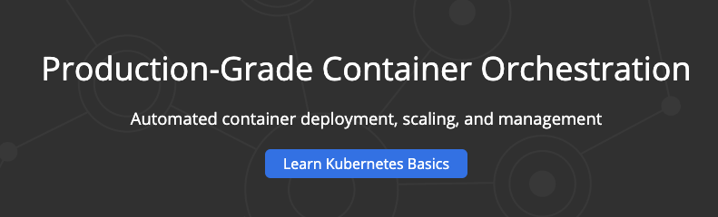
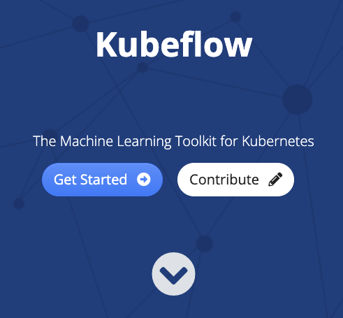

# Explore Kubernetes and KubeFlow

In the videos we explored Kubernetes and KubeFlow, and before going further, I strongly recommend that you have a play with them to see how they work. 

## Kubernetes

First is Kubernetes. The site is , and at the top of the page, there’s a big friendly button that says ‘Learn Kubernetes Basics’:

Click on this, and you’ll be taken to: 

From here you can go through a lesson to create a cluster, deploy and app, scale it, update it and more. It’s interactive, fun, and worth a couple of hours of your time to really get into how Kubernetes works.

You may also want to check this [video](https://youtu.be/H06qrNmGqyE) tutorial out. 

## KubeFlow

For KubeFlow, visit: , and at the top of the page, there’s a Get Started button.

Click on it to go to the tutorials. It doesn’t have the nice interactive tutorials that Kubernetes has, but, if you can, try to at least install KubeFlow on one of the deployment options listed on this page – even if it’s just your development machine. If you find it tricky to follow, don't worry because you will have an ungraded lab next week that will walk you through installing Kubeflow Pipelines (one of the Kubeflow components) in Kubernetes. In the meantime, you can watch this playlist particularly video #5 on Kubeflow Pipelines to get a short intro to this toolkit.
